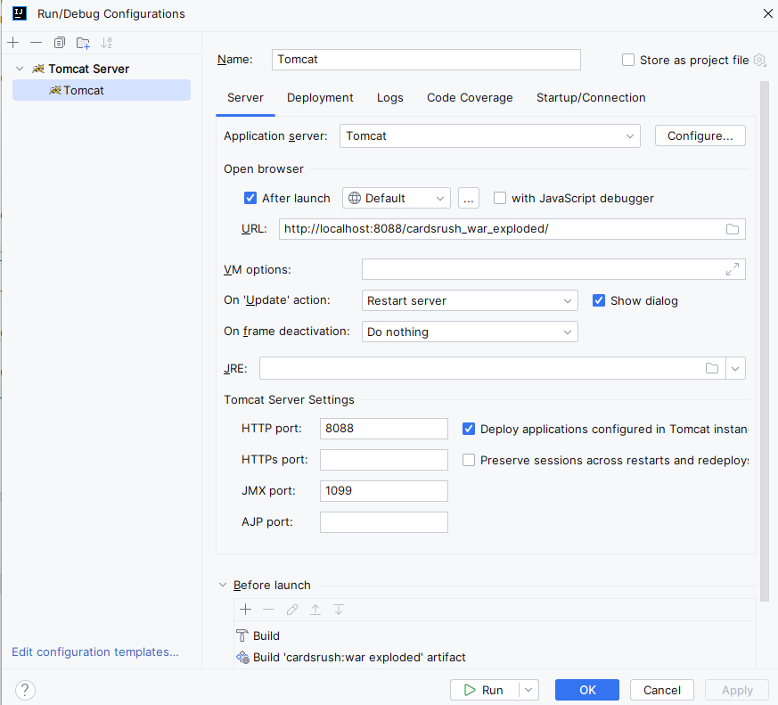

# Cards Rush - Projet Développement Web - 2024

Version anglaise disponible [ici](README_EN.md)

## Auteurs :
- [Kevin MITRESSÉ](http://kmitresse.free.fr)
- [Lucàs VABRE](https://lucasvbr.dev/)

## Installation

Pour pouvoir lancer le projet, vous devez avoir Docker et Maven installés sur votre machine.

### Installation de Docker Desktop

Pour installer Docker Desktop, rendez-vous sur le site officiel de Docker et téléchargez la version correspondant à votre système d'exploitation.

Lien : [Docker Desktop](https://www.docker.com/products/docker-desktop)

### Installation de Maven

Pour installer Maven, rendez-vous sur le site officiel de Maven et téléchargez la version correspondant à votre système d'exploitation.

Tutoriel d'installation : [Maven](https://www.baeldung.com/install-maven-on-windows-linux-mac)

### Prérequis supplémentaires (uniquement pour Windows)

Sur Windows, il est nécessaire d'avoir installé un terminal bash comme Git Bash ou Windows Terminal.

`Recommandé` Télécharger Git Bash (Facile d'utilisation et regroupe toutes les commandes bash) : [Git Bash](https://git-scm.com/downloads)

Télécharger Windows Terminal : [Windows Terminal](https://www.microsoft.com/fr-fr/p/windows-terminal/9n0dx20hk701?activetab=pivot:overviewtab)

### Installation du projet

Une fois tous les outils installés, suivez ces étapes pour installer le projet :

Depuis un terminal bash (ou Git Bash), positionnez-vous à la racine du projet puis lancez les commandes suivantes :

```bash
# Création des scripts .sql
./mysql/build.sh

# Lancement du container Docker contenant la base de données
# "cardsRush" est le nom du projet, vous pouvez le changer à votre guise
# Retirez la commande -p cardsRush si vous ne souhaitez pas nommer le projet, il portera par défaut le nom du dossier contenant le projet
docker-compose -p cardsRush up -d

# Installation des dépendances Maven
mvn clean package
mvn install
```

## Lancement du projet

Depuis IntelliJ, ouvrez l'onglet `File > Project Structure` et vérifiez que les artefacts suivants sont bien présents :
- project: war
- project: war exploded


Nous utilisons Tomcat pour lancer notre projet.

Sur IntelliJ, vous pouvez ajouter une configuration Tomcat depuis l'onglet "Edit Run Configurations", puis en cliquant sur le bouton "+" en haut à gauche de la fenêtre de lancement.

Éditez la configuration comme suit (le port utilisé pour Tomcat conseillé est 8080, mais vous pouvez le changer si vous le souhaitez ou s'il est déjà utilisé par un autre service sur votre machine) :




Enfin, allumez votre container Docker contenant la base de données, puis lancez l'application depuis votre navigateur.

## Parties multijoueurs

Cards Rush est un jeu multijoueurs. Pour jouer avec vos amis en local, vous devez être connecté au même réseau (même Wi-Fi, même partage de connexion, etc.).

Le lien à utiliser pour accéder au jeu est le suivant : `http://ip:8080/cardsrush_war_exploded/` (où "ip" est l'adresse IP de la machine hébergeant le serveur Tomcat).

L'application n'étant pas encore hébergée en ligne, il est nécessaire de lancer l'application sur une machine et de partager l'adresse IP de cette machine pour que les autres joueurs puissent se connecter.

## Potentielles améliorations à prévoir

- Hébergement du jeu en ligne.
- Ajout d'un chat pour les parties multijoueurs lorsque l'application sera hébergée en ligne.
