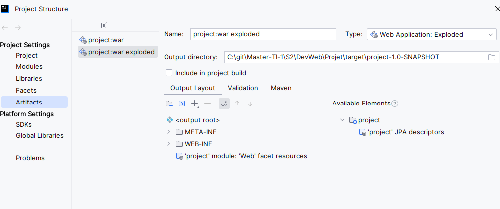
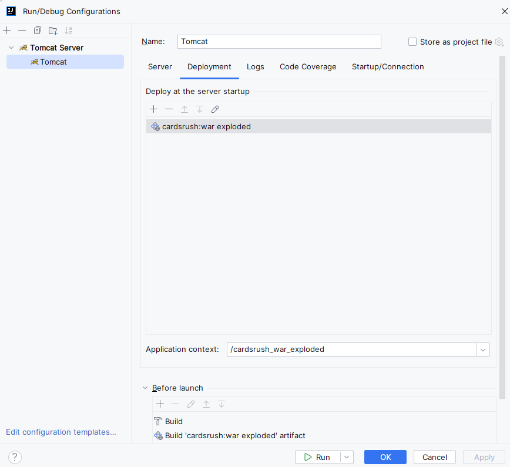

# Cards Rush - Web Development Project - 2024
[Version française disponible ici](README.md)

## Authors:
- [Kevin MITRESSÉ](http://kmitresse.free.fr)
- [Lucàs VABRE](https://portfolio-lucasvbr.vercel.app/)

## Installation
To be able to run the project, you need to have Docker and Maven installed on your machine.

### Installation of Docker Desktop
To install Docker Desktop, go to the official Docker website and download the version corresponding to your operating system.

Link: [Docker Desktop](https://www.docker.com/products/docker-desktop)

### Installation of Maven
To install Maven, go to the official Maven website and download the version corresponding to your operating system.

Installation tutorial: [Maven](https://www.baeldung.com/install-maven-on-windows-linux-mac)

### Additional prerequisites (only for Windows)
On Windows, you need to have installed a bash terminal system like Git Bash or Windows Terminal.

Recommended: Download Git Bash (Easy to use and groups all bash commands): [Git Bash](https://git-scm.com/downloads)

Download Windows Terminal: [Windows Terminal](https://www.microsoft.com/en-us/p/windows-terminal/9n0dx20hk701?activetab=pivot:overviewtab)

### Project Installation
Once all the tools are installed, run the following commands to install the project:

From a bash terminal (or Git Bash), navigate to the root of the project and run the following commands:

```bash
# Create the .sql scripts
./mysql/build.sh

# Launch the Docker container containing the database
# "cardsRush" is the name of the project, you can change it as you wish
# Remove the -p cardsRush command if you do not want to name the project, it will default to the name of the folder containing the project
docker-compose -p cardsRush up -d

# Install Maven dependencies
mvn clean package
mvn install

```

## Launch of the Project

From IntelliJ, open the `File > Project Structure` tab and check that the following artifacts are present:
- project: war
- project: war exploded



We use Tomcat to launch our project.

In IntelliJ, you can add a Tomcat configuration from the "Edit Run Configurations" tab, then by clicking on the "+" button at the top left of the launch window.

Edit the configuration as follows (the port used for Tomcat is 8080, but you can change it if you wish or if it is already used by another service on your machine):



Finally, start your Docker container containing the database and launch the application from your browser.

## Multiplayer Games

Cards Rush is a multiplayer game. To play with your friends locally, you must be connected to the same network (same Wi-Fi, same connection sharing, etc.).

The link to use to access the game is as follows: `http://ip:8080/cardsrush_war_exploded/` (where "ip" is the IP address of the machine hosting the Tomcat server).

Since the application is not yet hosted online, you need to launch the application on a machine and share the IP address of this machine so that other players can connect.

## Potential Improvements to Consider

- Hosting the game online.
- Adding a chat for multiplayer games when the application is hosted online.
