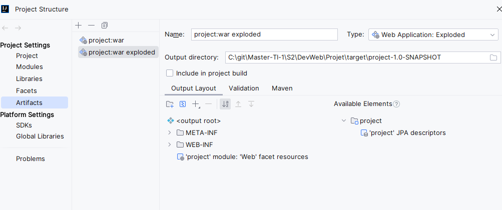
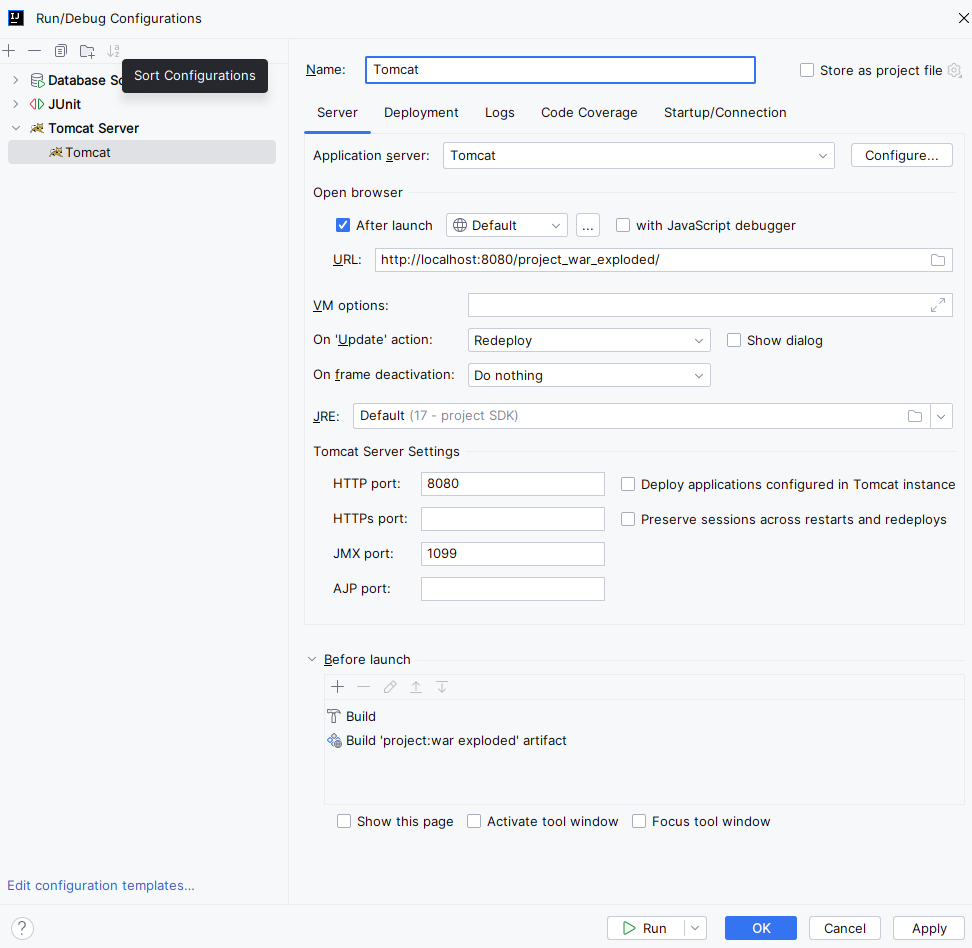

# Projet Développent Web - 2024

## Installation

Pour pouvoir lancer le projet, il vous faut avoir docker et maven d'installé sur votre machine.

### Installation de docker desktop

Pour installer docker desktop, rendez-vous sur le site officiel de docker et téléchargez la version correspondant à votre système d'exploitation.

Lien : [Docker Desktop](https://www.docker.com/products/docker-desktop)

### Installation de maven

Pour installer maven, rendez-vous sur le site officiel de maven et téléchargez la version correspondant à votre système d'exploitation.

Lien vers un tutoriel d'installation : [Maven](https://www.baeldung.com/install-maven-on-windows-linux-mac)

### Prérequis supplémentaires (uniquement pour windows)
Sur windows, il est nécessaire d'avoir installé un système de terminal bash comme git bash ou windows terminal.

`Recommandé` Lien vers git bash (Facile d'utilisation et regroupe toutes les commandes bash) : [Git Bash](https://git-scm.com/downloads)

Lien vers windows terminal : [Windows Terminal](https://www.microsoft.com/fr-fr/p/windows-terminal/9n0dx20hk701?activetab=pivot:overviewtab)

### Installation du projet
Une fois tous les outils installés. 
Lancez les commandes suivantes pour installer le projet :

Depuis un terminal bash (ou git bash), se positionner à la racine du projet puis lancez les commandes suivantes:

```` bash
# Création des scripts .sql
./mysql/build.sh

# Lancement du container docker contenant la base de données
# project_devweb est le nom du projet, vous pouvez le changer à votre guise
# retirer la commande -p project_devweb si vous ne souhaitez pas nommer le projet, il portera par défaut le nom du dossier contenant le projet
docker-compose -p project_devweb up -d

# Installation des dépendances maven
mvn install
````

## Lancement du projet
Depuis IntelliJ, ouvrir l'onglet `file > project structure` et ajouter les artefacts suivants :
- project: war
- project: war exploded



Nous utilisons tomcat pour lancer notre projet. 
Sur IntelliJ, vous pouvez ajouter une configuration Tomcat depuis l'onglet "edit run configurations", puis en cliquant sur le bouton "+" en haut à gauche de la fenêtre de lancement. 
Editez la configuration comme suit (le port utilisé pour Tomcat conseillé est 8080, mais vous pouvez le changer si vous le souhaitez ou s'il est déjà utilisé par un autre service sur votre machine) :

